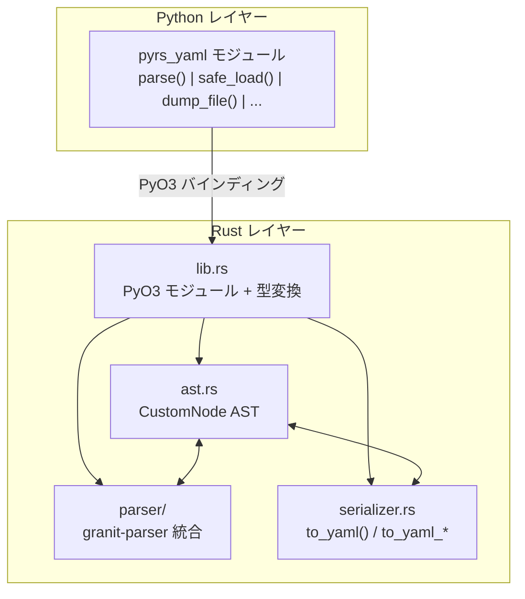
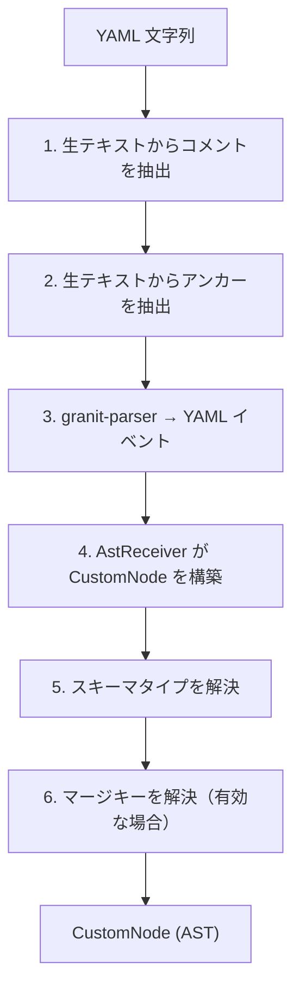
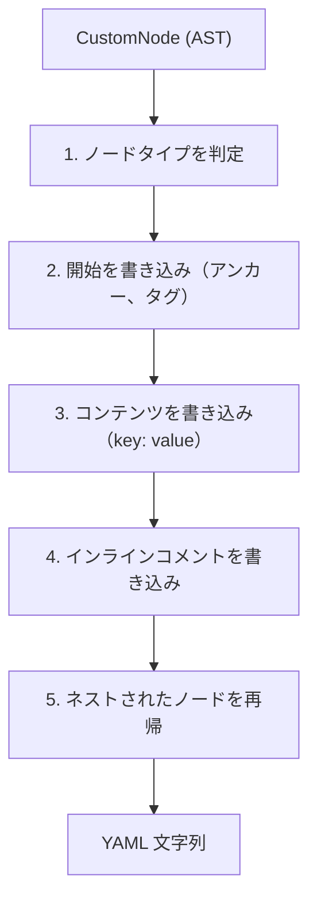

pyrs-yaml はパフォーマンスと正確性を考慮したモジュールアーキテクチャを使用しています。

## 概要



## ワークスペース構造

コードベースは `crates/` の下に2つのクレートに分割されています：

```text
crates/
├── pyrs-yaml-core/ # Pure Rust、PyO3 依存なし
│   └── src/
│       ├── lib.rs           # すべてのコアモジュールを再エクスポート
│       ├── ast.rs           # CustomNode AST
│       ├── editing/         # 編集プリミティブ（navigate, region, dirty, metadata）
│       ├── i18n.rs          # 国際化
│       ├── parser/          # YAML パーサー（granit-parser ベース）
│       ├── serializer.rs    # YAML シリアライザー
│       └── splice.rs        # スプライスベースのテキストアセンブリ
└── pyrs-yaml/               # PyO3 バインディングレイヤー
    └── src/
        ├── lib.rs           # コアの再エクスポート + #[pymodule] の定義
        ├── py/              # PyO3 バインディング
        │   ├── mod.rs       # YamlDocument pyclass
        │   ├── convert.rs   # CustomNode ↔ Python 型変換
        │   └── editing/     # Python 向け編集ラッパー
        └── fidelity.rs      # プロパティベーステスト
```

## モジュールアーキテクチャ

### 1. `crates/pyrs-yaml-core/src/ast.rs` — カスタム AST

**CustomNode** 列挙型は pyrs-yaml の核心です：

- **Scalar** — スタイル (plain, 引用符付き, リテラル, フォールド)、コメント、アンカー、タグ、チョンピング付き
- **Mapping** — キー順序保持用 `IndexMap`、flow_style フラグ
- **Sequence** — 順序付きリスト、flow_style フラグ
- **Null** — コメント、アンカー、タグ付き
- **Alias** — エイリアス参照（名前のみ）

#### カスタム AST を使う理由

- 標準 YAML パーサーはメタデータ（コメント、フォーマット）を破棄する
- カスタム AST は往返保存に必要なすべてを保持する
- 将来の機能（カスタムノードタイプ、メタデータ）に拡張可能

#### 2. `crates/pyrs-yaml-core/src/parser/` — YAML パーサー

**granit-parser**（YAML 1.2 準拠）上に構築：

- **`mod.rs`** — `AstReceiver` ステートマシン、イベントベースパース、フロースタイル検出
- **`stream.rs`** — ストリーミングイベントパーサー（行単位の YAML イベント）
- **`yaml/comment.rs`** — 生テキストからのコメントとアンカーの抽出
- **`yaml/merge.rs`** — マージキー (`<<`) の解決
- **`yaml/scalar.rs`** — スカラースタイル検出、エスケープ解除、チョンピング
- **`yaml/schema.rs`** — YAML スキーマ解決（core, JSON, failsafe, YAML 1.1）
- **`yaml/types.rs`** — YAML 1.2 型解決（null, bool, int, float）

##### 重要な設計判断

- イベントベース API（トークンベースではない）— 構造化出力に最適
- 2 パスパース：まずコメント/アンカーを抽出し、次にイベントをパース
- マージキーの解決はパース後に実行（設定可能）

#### 3. `crates/pyrs-yaml-core/src/serializer.rs` — YAML シリアライザー

AST から YAML を再構築するカスタムシリアライザー：

- **`to_yaml()`** — デフォルトオプションでシリアライズ
- **`to_yaml_with_options()`** — カスタムインデント、マーカー、ソート
- **`write_anchor_tag()`** — アンカー/タグ出力用ヘルパー
- **`write_inline_comment()`** — インラインコメント出力用ヘルパー

##### 重要な設計判断

- サードパーティエミッタ不使用 — 出力フォーマットを完全に制御
- ネストされた構造のインデントレベル状態管理
- ブロックスカラーのチョンピングインジケーター処理

#### 4. `crates/pyrs-yaml/src/py/` — PyO3 バインディング

Python から Rust の機能を公開するレイヤー：

- **`mod.rs`** — `YamlDocument` pyclass、`#[pymodule]` エントリポイント
- **`convert.rs`** — Python ↔ CustomNode 変換とエラーフォーマット
- **`python_types.rs`** — Python → CustomNode 型変換
- **`ndarray.rs`** — NumPy ndarray シリアライゼーション（オプション、`numpy` フィーチャー）
- **`stream_events.rs`** — ストリームイベント型（Python 用）
- **`streaming.rs`** — ストリーミングパース（定数メモリ）
- **`writing.rs`** — ストリーミング書き込み（定数メモリ）
- **`tag_registry.rs`** — Python タグハンドラ登録
- **`editing/`** — Python 向け編集ラッパー（`segment_py.rs` + コアからの再エクスポート）

Python 向け編集 API が使用する Pure Rust 編集プリミティブ：

- **`navigate.rs`** — AST パスナビゲーション（`navigate`, `navigate_mut`, `key_eq`, `mapping_key_index`, `normalize_index`, `parse_path_segments`）
- **`region.rs`** — 編集領域計算（`path_nodes`, `region_unit`, `precompute`, 行ヘルパー, `extend_delete_over_comments`）
- **`dirty.rs`** — 編集操作型（`DirtyKind`, `DirtyUnit`）
- **`metadata.rs`** — メタデータ保存（`with_metadata_from`）

**公開 Python 関数（全18個）：**
`parse`, `safe_load`, `safe_loads`, `safe_dump`, `safe_dumps`, `parse_file`, `dump_file`, `parse_all_docs`, `parse_stream`, `read_markdown`, `from_dict`, `from_json`, `set_language`, `get_language`, `list_languages`, `detect_language`, `negotiate_language`, `YamlDocument`

#### 5. `crates/pyrs-yaml-core/src/i18n.rs` — 国際化

- `i18n.rs` — 設定と言語ネゴシエーション
- ロケールバンドル（en, zh-CN, ja-JP, ko-KR）
- フォーマット文字列付きバイリンガルエラーメッセージ

#### 6. `crates/pyrs-yaml-core/src/integration/` — 統合ヘルパー

- `yaml_suite.rs` — YAML Test Suite ランナー（検証用）
- ベンチマークとコンプライアンスチェック用テストヘルパー

## データフロー

### パースフロー



#### シリアライズフロー



## パフォーマンス特性

| 操作 | 計算量 | 備考 |
|------|--------|------|
| パース | O(n) | YAML イベントの単一パス |
| シリアライズ | O(n) | AST の単一パス |
| 往返保存 | O(n) | パース + シリアライズ |
| マージ解決 | O(n × m) | n = ドキュメント数、m = ドキュメントあたりのマージ数 |
| コメント抽出 | O(n) | 生テキストの単一パス |

## 依存関係

| クレート | 目的 |
|---------|------|
| **PyO3** | Python バインディング（`experimental-inspect`、`abi3-py38`、`abi3t` 付き） |
| **granit-parser** | YAML 1.2 準拠パース |
| **IndexMap** | キー順序保持用の順序付きハッシュマップ |
| **serde_json** | JSON ↔ YAML 変換 |
| **numpy** | NumPy ndarray サポート（オプション、デフォルト有効） |
| **rust-i18n** | 国際化エラーメッセージ |
