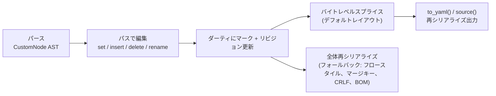

pyrs-yaml では、**パース済みドキュメントをその場で編集**でき、すべてのフォーマットメタデータ（コメント、アンカー、タグ、スカラースタイル、フロー/ブロックスタイル）を保持します — 手作業による文字列加工は不要で、忠実性の損失もありません。

## 概要

編集は、ドキュメントツリーへの **JSONPath スタイルのパス** で表現します：

```python title="パスで編集"
import pyrs_yaml

doc = pyrs_yaml.parse("""
db:
  host: localhost
  port: 5432
""")

doc.set("$.db.host", "db.example.com")  # set by path
doc.set("$.db.port", 5433)
print(doc.to_yaml())
# db:
#   host: db.example.com
#   port: 5433
```

すべての編集メソッドは**アトミック**です：失敗した場合、ドキュメント（リビジョンを含む）は何も変更されません。成功するとドキュメントはダーティとしてマークされ、次の `source()` / `to_yaml()` / `to_yaml_with_options()` / `reparse()` 呼び出しで更新されたツリーから再シリアライズされます。

### 編集パイプライン



## パス構文

パスは `$` で始まり、ドット区切りのキー（マッピング）または `[N]` インデックス（シーケンス）が続きます：

| パス | 意味 |
|------|------|
| `$.host` | ルートマッピングのキー `host` |
| `$.a.b.c` | ネストされたキー |
| `$.items[0]` | シーケンス `items` の最初の要素 |
| `$` | ルートノード自体 |

- **負のインデックス**（`[-1]`、`[-2]`、...）は**サポートされています** — シーケンスの末尾から数えます（Python と同じセマンティクス：`-1` は最後の要素）。範囲外の負のインデックスは `YamlEditError` を発生させます
- キーは**値でマッチ**します（メタデータには依存しません）。そのため、クォート付きキー `"host"` はプレーンキー `host` にマッチします

編集パスは正確に 1 つのノードを対象とする必要があります — **ワイルドカード**（`[*]`）と**ディープスキャン**（`..`）は `YamlPathError` を発生させます。（クエリ専用の `find()` ではこれらを使用できます。[`find()` によるクエリ](#find) を参照してください。）

**発生する例外:** 不正なパスでは `YamlPathError` が、パスのステップを適用できない場合（スカラーへのナビゲーションやエイリアス経由の編集など）は `YamlEditError` が発生します。

## 値の設定

### `set()` — パスによる置換

```python title="set() シグネチャ"
set(path: str, value: Any) -> None
```

```python title="set() 例"
doc = pyrs_yaml.parse("a:\n  b: 1\nitems: [1, 2, 3]")

doc.set("$.a.b", 42)  # scalar → scalar, metadata preserved
doc.set("$.items[1]", "two")  # sequence index
doc.set("$.a.c", True)  # add a new key to a mapping (last position)
doc.set("$", {"x": 1})  # replace the entire root
```

値の変換ルール：

| Python 値 | YAML ノード |
|-----------|-------------|
| :material-format-text: `str`, :material-numeric: `int`, :material-decimal: `float`, :material-toggle-switch: `bool`, :material-null: `None` | 新しいスカラー（値は*再パースされません*） |
| :material-language-python: `dict` | 新しいマッピング（プレーンスタイル） |
| :material-format-list-numbered: `list` | 新しいシーケンス（プレーンスタイル） |
| :material-alert: `tuple` | サポートされません — `YamlEditError` を発生 |

既存のスカラーを置換する場合、対象のメタデータ（インラインコメント、アンカー、タグ、クォートスタイル）は**保持**されます — ただし、新しい値がマッピング/シーケンスの場合は、新しいノード自身のフォーマットが採用されます。

#### `__setitem__` — ルート用糖衣構文

```python
doc["b"] = 2  # equivalent to doc.set("$.b", 2)
```

#### `Node.set_value()` — ノード経由の編集

```python
node = doc.node().find("$.a.b")  # see "Working with Nodes"
node.set_value(42)
```

## 挿入と追加

どちらも**シーケンスのみ**を対象とします。パスはシーケンスノードに解決される必要があります。

### `insert()` — インデックス位置への挿入

```python title="insert() シグネチャ"
insert(path: str, index: int, value: Any) -> None
```

`index` は現在の長さまで指定できます（`len` に挿入すると末尾への追加になります）。それより大きい場合は `YamlEditError` を発生します。負のインデックスは末尾から数えます（`-1` は最後の要素の前に挿入、`-len` は先頭に挿入）。

```python title="insert() 例"
doc = pyrs_yaml.parse("items:\n  - a\n  - c")

doc.insert("$.items", 1, "b")  # items: [a, b, c]
doc.insert("$.items", 0, "first")
doc.insert("$.items", 3, "last")  # index == len appends
doc.insert("$.items", -1, "before-last")  # items: [a, before-last, c]
```

#### `append()` — 末尾に追加

```python title="append() シグネチャ"
append(path: str, value: Any) -> None
```

```python title="append() 例"
doc.append("$.items", "d")
```

#### `Node.append()` / `Node.insert()`

同じ操作を `Node` オブジェクトでも利用できます：

```python
node = doc.node().find("$.items")
node.append("d")
node.insert(1, "x")
```

## 削除

### `delete()` — パスによる削除

```python title="delete() シグネチャ"
delete(path: str) -> None
```

```python
doc = pyrs_yaml.parse("a: 1\nb: 2\nc: 3")
doc.delete("$.b")
print(doc.to_yaml())  # a: 1\nc: 3\n — order preserved
```

マッピングの順序は常に保持されます。シーケンスの削除では隙間が詰められます。

#### `__delitem__` — ルート用糖衣構文

```python
del doc["b"]  # equivalent to doc.delete("$.b")
```

#### `Node.delete()`

```python
node = doc.node().find("$.b")
node.delete()
```

## リネーム

### `rename()` — マッピングキーのその場リネーム

```python title="rename() シグネチャ"
rename(path: str, new_key: str) -> None
```

パスは**マッピングキー**を指している必要があります（値はそのキーの下にあり、メタデータを保持します）：

```python
doc = pyrs_yaml.parse("old: value  # keep me\nnext: 1")
doc.rename("$.old", "new")
print(doc.to_yaml())  # new: value  # keep me\nnext: 1
```

- **位置は保持** — リネームされたキーは元の位置に留まります
- **メタデータは保持** — キーのインラインコメント、スタイル、アンカーはリネームとともに移動します
- ルートや複合（非スカラー）キーのリネーム、および**既存キーへの**リネームは `YamlEditError` を発生させます（同一キーへのリネームは何も行いません）

#### `Node.rename()`

```python
node = doc.node().find("$.old")
node.rename("new")
```

## タグとメタデータ

コメント、アンカー、タグはデフォルトでラウンドトリップ時に保持されます。`Node` 経由で読み取り・編集も可能で、編集はその場で再シリアライズされ、他の要素はすべて保持されます。

### メタデータの読み取り

```python
doc = pyrs_yaml.parse("key: !!str value  # note")
node = doc.node().find("$.key")
node.comment  # "note"
node.anchor   # None
node.tag      # "!!str"
```

- `comment` — インラインまたはスタンドアロンのコメントテキスト（`#` プレフィックスなし）、または `None`
- `anchor` — アンカー名、または `None`
- `tag` — YAML タグ文字列、または `None`

#### `Node.set_comment()` / `Node.remove_comment()`

```python
node.set_comment("new note")                   # スタンドアロン: ノードの上の行
node.set_comment("inline", standalone=False)   # ノードの後ろにインライン
node.remove_comment()
```

#### `Node.set_anchor()` / `Node.remove_anchor()`

```python
node.set_anchor("cfg")
node.remove_anchor()
```

アンカーはドキュメント内の別の場所でエイリアスから参照できます。

#### `Node.set_tag()` / `Node.remove_tag()`

```python
node.set_tag("!custom")                  # ローカルタグ
node.set_tag("!!int")                    # プライマリタグ
node.set_tag("!<tag:yaml.org,2002:str>") # バーベイタムタグ
node.remove_tag()
```

- **エイリアス**ノード（`*ref`）または**存在しないパス**へのメタデータ編集は `YamlEditError` を発生させます
- 編集後、ノードは**stale** になります — 次にアクセスする前に `doc.node().find(path)` で再検索してください

## ノードの操作

`doc.node()` はドキュメントルートの `Node` を返し、`Node.find(path)` はサブツリーに移動します：

=== "ドキュメントパス API"

    ```python
    node = doc.find("$.db.host")  # navigate by path
    print(node.value)  # "localhost"
    node.set_value("other")  # edit through the node
    print(node.root_type)  # "scalar" | "mapping" | "sequence" | "null"
    ```

=== "Node API"

    ```python
    node = doc.node()  # root node
    node = doc.node().find("$.db.host")  # navigate by path
    print(node.value)  # "localhost"
    node.set_value("other")  # edit through the node
    print(node.root_type)  # "scalar" | "mapping" | "sequence" | "null"
    ```

ノードはツリー API を公開しています：`node.parent`、`node.children`、`node.walk()`（深さ優先イテレーター）、`node.filter(predicate)`、`node.to_yaml()`。

### AST の走査（`doc.walk()` / `doc.scalars()`）

`doc.walk()` と `doc.scalars()` は**Rust バックエンド**の走査メソッドで、AST 全体を Python dict に変換せずに `Node` オブジェクトを生成します。`Node.walk()`（内部で `to_dict()` を呼び出す）とは異なり、これらのメソッドは AST を直接走査します：

```python
doc = pyrs_yaml.parse("a:\n  b: 1\n  c: 2\n")

# すべてのノードを走査（深さ優先、先行順）
for node in doc.walk():
    print(node._path, node.root_type)
# ()       mapping
# ('a',)   mapping
# ('a', 'b') scalar
# ('a', 'c') scalar

# スカラー/null ノードのみを走査
for node in doc.scalars():
    print(node._path, node.value)
# ('a', 'b') 1
# ('a', 'c') 2
```

これは、特にパス情報やスカラー値のみが必要な場合、大規模ドキュメントに対して Python のみの `Node.walk()` よりも大幅に高速です。

#### 不足キーの自動作成（`create_missing=True`）

デフォルトでは、`set()` はパス内の中間キーが存在しない場合に `YamlEditError` を発生させます。`create_missing=True` を指定すると、不足している中間マッピングキーが自動的に作成されます：

```python
doc = pyrs_yaml.parse("a: 1\n")

# create_missing なし — エラー
doc.set("$.b.c.d", 2)  # YamlEditError: missing path

# create_missing あり — b → c → d を作成
doc.set("$.b.c.d", 2, create_missing=True)
print(doc.to_yaml())
# a: 1
# b:
#   c:
#     d: 2
```

ルール：

- 不足している**マッピングキー**は、ネストされたマッピングとして作成されます
- 不足している**インデックスセグメント**はエラーになります（シーケンス要素は自動生成できません）
- 途中に**スカラー**がある場合もエラーになります（スカラー内には降下できません）
- 作成されたチェーンはインプレーススプライス編集の対象になります

#### `find()` によるクエリ

`find()` は**読み取り指向**で、ワイルドカードとディープスキャンをサポートします — パスが複数のノードを選択する場合はリストを返します：

```python
doc.node().find("$.items[*]")  # all items of a sequence (list of Nodes)
doc.node().find("$..timeout")  # deep search for any key named "timeout"
```

ワイルドカード/ディープスキャンの結果は `set()` では**直接編集できません** — 一度の呼び出しでワイルドカードパスに値を適用するには `doc.set_many()` を使用します（下記）。

### 一括・構造編集

#### `doc.set_many()` — 複数値を一度に設定

複数のパスを単一のスプライスバーストで設定します。パスにワイルドカード（`[*]`）やディープスキャン（`..`）を含められます — 一致するすべてのノードが設定されます：

```python
doc = pyrs_yaml.parse("items:\n  - pass: true\n  - pass: true\n")
doc.set_many({
    "$.items[*].pass": False,   # ワイルドカード: 全アイテム
    "$.name": "config",          # 通常パス
})
```

#### `doc.sort_keys()` — マッピングキーの並べ替え

マッピング（デフォルト: ルート）のキーをその場で並べ替えます：

```python
doc = pyrs_yaml.parse("z: 1\na: 2\nm: 3\n")
doc.sort_keys()           # ルートマッピングを並べ替え
print(doc.to_yaml())      # a: 2\nm: 3\nz: 1
```

#### `Node.move(new_path)` — サブツリーの移動

サブツリーを同じドキュメント内の新しいパスへ移動します（コピー後にソースを削除）：

```python
doc = pyrs_yaml.parse("src:\n  x: 1\ndst: {}\n")
doc.node().find("$.src").move("$.dst")
print(doc.to_yaml())      # dst:\n  x: 1
```

#### `Node.path` / `Node.find_first()` / `Node.value_eq()`

```python
node = doc.node().find("$.a.b")
node.path                  # ('a', 'b') — パスセグメント
doc.node().find_first("$.items[*]")  # 最初のワイルドカード一致または None
node.value_eq(other_node)  # 解決後の値を比較（参照同一性ではない）
```

## エイリアスとマージキー

!!! warning "エイリアス越しの編集"
    エイリアス*経由*の編集（`*defaults` を通過してマージされたキーに到達する）は `YamlEditError` を発生させます。参照先ノードは別の場所にあるため、直接編集できません。

エイリアスノード（`*name`）は、その自身のパスが設定されると**その場で**置き換えられます：

```python
yaml = "defaults: &defaults\n  timeout: 30\nprod: *defaults\n"
doc = pyrs_yaml.YAML(typ="safe").parse(yaml)  # resolve_merges=false keeps the alias node

doc.set("$.prod", {"timeout": 99})  # replaces the alias node — prod.timeout: 99
```

- エイリアス**経由**の設定（`*defaults` を通過してマージされたキーに到達する）は `YamlEditError` を発生させます — 参照先ノードは別の場所にあります
- マージキーを解決した場合（デフォルト）、マージ展開されたキーはクローンです。それらを編集してもクローンのみが編集されます
- アンカー付きノードの削除は許容されます（アンカーが参照されなくなるだけです）

## ビューと AST

`doc.get()` / `doc.to_dict()` は**ビュー**（解決された値）を返します。編集は常に**AST**に対して行われます：

```python
doc = pyrs_yaml.parse("on: yes")
print(doc.get("on"))  # True   — view (core schema resolution)
doc.set("$.on", "off")  #         — edits the AST scalar
print(doc.to_yaml())  # on: off — serialized verbatim, no re-resolution
```

編集された値は**そのまま**出力されます。ビューはアクティブなスキーマに従ってそれを解決します。

## 陳腐化したノード

`Node` はドキュメントの**リビジョン**に結び付けられており、ノードの作成時に記録されます。ドキュメントの編集（別のノード経由でも）はリビジョンを増加させるため、以前に取得したノードは陳腐化します：

```python
node = doc.node().find("$.a")
doc.set("$.b", 2)  # bumps the revision
node.set_value(99)  # RuntimeWarning + YamlDocumentError (stale)
```

編集後はノードを再取得して作業を続けてください。`node.is_valid()` は生存性をチェックし、`node.release()` はノードをドキュメントから明示的に切り離します。

## エラーハンドリング

| エラー | 発生時 |
|-------|--------|
| :material-alert: `YamlPathError` | 不正なパス、編集パスでのワイルドカード/`..` の使用 |
| :material-alert: `YamlEditError` | サポートされない値型（`tuple`）、エイリアス経由の編集、ルート/複合/既存キーのリネーム、スカラーへのナビゲーション、インデックス範囲外 |
| :material-alert: `YamlDocumentError` | ドキュメント編集後に陳腐化した `Node` を使用 |

すべての編集はアトミックです — 失敗した編集はドキュメント（とそのリビジョン）に影響を与えません。

## 完全な例

```python
import pyrs_yaml

doc = pyrs_yaml.parse("""
# server config
server:
  host: localhost  # bind address
  ports:
    - 8080
    - 9090
""")

doc.set("$.server.host", "0.0.0.0")
doc.insert("$.server.ports", 0, 80)
doc.append("$.server.ports", 443)
doc.rename("$.server", "srv")

print(doc.to_yaml())
# server config
# srv:
#   host: 0.0.0.0  # bind address
#   ports:
#     - 80
#     - 8080
#     - 9090
#     - 443
```

コメント、アンカー、タグ、スカラースタイル、フロー/ブロックフォーマットはすべて保持されます。

## パフォーマンス

!!! tip "バイトレベルスプライス編集"
    デフォルトレイアウトのドキュメントでは、編集は未変更テキストをそのままコピーするバイトレベルのスプライスとして適用され、全再シリアライズと比較して**最大100倍高速**になります。

**フォールバック**（全再シリアライズ）は以下で発生します：

- 編集されたノードまたはその祖先が**フロースタイル**（`{...}`、`[...]`）を使用
- ドキュメントが**非デフォルトレイアウト**（CRLF行末、BOM、非標準インデント）
- ドキュメントに**マージキー**（`<<: *anchor`）が含まれる
- 単一文字列から複数ドキュメントが解析された
- スプライス状態が以前の materialize で**消費**された（シングルバーストモデル）

すべてのフォールバックケースで、正確性は保証されます — パフォーマンス上の利点のみが失われます。

### ベンチマーク

```text
Benchmark                   Median
serialize_10mb             17 ms
edit_flush_set_10mb       110 ms
edit_flush_burst5_10mb    119 ms
```

500グループ×838キーの合成10MBブロックマッピングドキュメントで測定。比率はASTクローンコスト（56ms）が支配的；実際の編集+materializeは約54ms（シリアライズの3倍）。コメント、アンカー、タグを含む複雑なドキュメントでは、スプライスの利点が大幅に拡大します。
