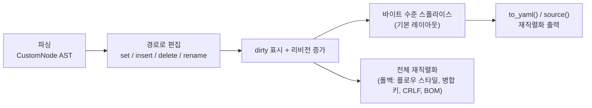

pyrs-yaml는 파싱된 문서를 **제자리에서 편집**할 수 있게 해주며, 모든 포맷 메타데이터(주석, 앵커, 태그, 스칼라 스타일, 흐름/블록 스타일)를 보존합니다 — 수동 문자열 조작 없이, 충실도 손실 없이.

## 개요

편집은 문서 트리에 대한 **JSONPath 스타일 경로**로 표현됩니다:

```python title="경로로 편집"
import pyrs_yaml

doc = pyrs_yaml.parse("""
db:
  host: localhost
  port: 5432
""")

doc.set("$.db.host", "db.example.com")  # set by path
doc.set("$.db.port", 5433)
print(doc.to_yaml())
# db:
#   host: db.example.com
#   port: 5433
```

모든 편집 메서드는 **원자적**입니다: 실패 시 문서 리비전을 포함해 아무것도 변경되지 않습니다. 성공 시 문서는 dirty로 표시되며, 다음 `source()` / `to_yaml()` / `to_yaml_with_options()` / `reparse()` 호출 시 업데이트된 트리에서 재직렬화됩니다.

### 편집 파이프라인



## 경로 구문

경로는 `$`로 시작하며 점으로 구분된 키(매핑) 또는 `[N]` 인덱스(시퀀스)가 이어집니다:

| 경로 | 의미 |
|------|------|
| `$.host` | 루트 매핑의 `host` 키 |
| `$.a.b.c` | 중첩 키 |
| `$.items[0]` | 시퀀스 `items`의 첫 번째 요소 |
| `$` | 루트 노드 자체 |

- **음수 인덱스** (`[-1]`, `[-2]`, ...)는 **지원됩니다** — 시퀀스 끝에서부터 셉니다 (Python과 동일한 의미: `-1`은 마지막 요소). 범위를 벗어난 음수 인덱스는 `YamlEditError`를 발생시킵니다
- 키는 **값 기준**으로 일치하므로(메타데이터 무관), 따옴표 키 `"host"`는 일반 키 `host`와 일치합니다

편집 경로는 정확히 하나의 노드를 대상으로 해야 합니다 — **와일드카드** (`[*]`)와 **딥 스캔** (`..`)은 `YamlPathError`를 발생시킵니다. (쿼리 전용 `find()`는 이를 지원합니다. [find()로 쿼리하기](#find) 참조)

**발생:** 잘못된 경로에 대해 `YamlPathError`, 경로 단계를 적용할 수 없을 때(예: 스칼라로의 탐색, 별칭을 통한 편집) `YamlEditError`.

## 값 설정

### `set()` — 경로로 교체

```python title="set() 시그니처"
set(path: str, value: Any) -> None
```

```python title="set() 예제"
doc = pyrs_yaml.parse("a:\n  b: 1\nitems: [1, 2, 3]")

doc.set("$.a.b", 42)  # scalar → scalar, metadata preserved
doc.set("$.items[1]", "two")  # sequence index
doc.set("$.a.c", True)  # add a new key to a mapping (last position)
doc.set("$", {"x": 1})  # replace the entire root
```

값 변환 규칙:

| Python 값 | YAML 노드 |
|-----------|-----------|
| :material-format-text: `str`, :material-numeric: `int`, :material-decimal: `float`, :material-toggle-switch: `bool`, :material-null: `None` | 새 스칼라 (값은 *재파싱되지 않음*) |
| :material-language-python: `dict` | 새 매핑 (일반 스타일) |
| :material-format-list-numbered: `list` | 새 시퀀스 (일반 스타일) |
| :material-alert: `tuple` | 지원되지 않음 — `YamlEditError` 발생 |

기존 스칼라를 교체할 때 대상의 메타데이터(인라인 주석, 앵커, 태그, 따옴표 스타일)는 **보존**됩니다 — 새 값이 매핑/시퀀스인 경우는 예외로, 새 노드 자체의 서식을 따릅니다.

#### `__setitem__` — 루트 슈가

```python
doc["b"] = 2  # equivalent to doc.set("$.b", 2)
```

#### `Node.set_value()` — Node를 통한 편집

=== "문서 경로 API"

    ```python
    doc.set("$.a.b", 42)  # 경로로 직접 편집
    ```

=== "Node API"

    ```python
    node = doc.node().find("$.a.b")  # see "Working with Nodes"
    node.set_value(42)
    ```

## 삽입 및 추가

둘 다 **시퀀스에만** 적용됩니다; 경로는 시퀀스 노드를 가리켜야 합니다.

### `insert()` — 인덱스에 삽입

```python title="insert() 시그니처"
insert(path: str, index: int, value: Any) -> None
```

`index`는 현재 길이까지 허용됩니다 (`len`에 삽입하면 추가됨); 그보다 크면 `YamlEditError`가 발생합니다. 음수 인덱스는 끝에서부터 셉니다 (`-1`은 마지막 요소 앞에 삽입, `-len`은 맨 앞에 삽입).

```python title="insert() 예제"
doc = pyrs_yaml.parse("items:\n  - a\n  - c")

doc.insert("$.items", 1, "b")  # items: [a, b, c]
doc.insert("$.items", 0, "first")
doc.insert("$.items", 3, "last")  # index == len appends
doc.insert("$.items", -1, "before-last")  # items: [a, before-last, c]
```

#### `append()` — 끝에 추가

```python title="append() 시그니처"
append(path: str, value: Any) -> None
```

```python title="append() 예제"
doc.append("$.items", "d")
```

#### `Node.append()` / `Node.insert()`

동일한 작업을 `Node` 객체에서도 사용할 수 있습니다:

```python
node = doc.node().find("$.items")
node.append("d")
node.insert(1, "x")
```

## 삭제

### `delete()` — 경로로 제거

```python title="delete() 시그니처"
delete(path: str) -> None
```

```python
doc = pyrs_yaml.parse("a: 1\nb: 2\nc: 3")
doc.delete("$.b")
print(doc.to_yaml())  # a: 1\nc: 3\n — order preserved
```

매핑 순서는 항상 보존됩니다; 시퀀스 삭제는 빈자리를 메웁니다.

#### `__delitem__` — 루트 슈가

```python
del doc["b"]  # equivalent to doc.delete("$.b")
```

#### `Node.delete()`

```python
node = doc.node().find("$.b")
node.delete()
```

## 이름 변경

### `rename()` — 매핑 키 제자리 이름 변경

```python title="rename() 시그니처"
rename(path: str, new_key: str) -> None
```

경로는 **매핑 키**를 가리켜야 합니다 (그 아래 값이 메타데이터를 유지합니다):

```python
doc = pyrs_yaml.parse("old: value  # keep me\nnext: 1")
doc.rename("$.old", "new")
print(doc.to_yaml())  # new: value  # keep me\nnext: 1
```

- **위치가 보존됩니다** — 이름이 변경된 키는 제자리에 유지됩니다
- **메타데이터가 보존됩니다** — 키의 인라인 주석, 스타일, 앵커가 이름 변경과 함께 이동합니다
- 루트 또는 복합(비스칼라) 키의 이름 변경, 그리고 **기존 키로의** 이름 변경은 `YamlEditError`를 발생시킵니다 (자기 자신으로의 이름 변경은 no-op)

#### `Node.rename()`

```python
node = doc.node().find("$.old")
node.rename("new")
```

## 태그와 메타데이터

주석, 앵커, 태그는 기본적으로 라운드트립 시 보존됩니다. `Node`를 통해 읽기·편집도 가능하며, 편집은 제자리에서 다시 직렬화되어 나머지 요소는 모두 보존됩니다.

### 메타데이터 읽기

```python
doc = pyrs_yaml.parse("key: !!str value  # note")
node = doc.node().find("$.key")
node.comment  # "note"
node.anchor   # None
node.tag      # "!!str"
```

- `comment` — 인라인 또는 스탠드얼론 주석 텍스트 (`#` 접두사 제외), 없으면 `None`
- `anchor` — 앵커 이름, 없으면 `None`
- `tag` — YAML 태그 문자열, 없으면 `None`

### `Node.set_comment()` / `Node.remove_comment()`

```python
node.set_comment("new note")                   # 스탠드얼론: 노드 위의 줄
node.set_comment("inline", standalone=False)   # 노드 뒤에 인라인
node.remove_comment()
```

### `Node.set_anchor()` / `Node.remove_anchor()`

```python
node.set_anchor("cfg")
node.remove_anchor()
```

앵커는 문서의 다른 곳에서 별칭으로 참조할 수 있습니다.

### `Node.set_tag()` / `Node.remove_tag()`

```python
node.set_tag("!custom")                  # 로컬 태그
node.set_tag("!!int")                    # 프라이머리 태그
node.set_tag("!<tag:yaml.org,2002:str>") # verbatim 태그
node.remove_tag()
```

- **별칭** 노드(`*ref`) 또는 **존재하지 않는 경로**에 대한 메타데이터 편집은 `YamlEditError`를 발생시킵니다
- 편집 후 노드는 **stale** 상태가 됩니다 — 다음 접근 전에 `doc.node().find(path)`로 다시 찾으세요

## Node 작업

`doc.node()`는 문서 루트의 `Node`를 반환합니다; `Node.find(path)`는 하위 트리로 이동합니다:

```python
node = doc.node()  # root node
node = doc.node().find("$.db.host")  # navigate by path
print(node.value)  # "localhost"
node.set_value("other")  # edit through the node
print(node.root_type)  # "scalar" | "mapping" | "sequence" | "null"
```

Node는 트리 API를 제공합니다: `node.parent`, `node.children`, `node.walk()` (깊이 우선 반복자), `node.filter(predicate)`, `node.to_yaml()`.

### AST 탐색 (`doc.walk()` / `doc.scalars()`)

`doc.walk()`과 `doc.scalars()`는 **Rust 기반** 순회 메서드로, 전체 AST를 Python dict로 변환하지 않고 `Node` 객체를 생성합니다. `Node.walk()`와 달리 (내부적으로 `to_dict()`를 호출), 이 메서드들은 AST를 직접 순회합니다:

```python
doc = pyrs_yaml.parse("a:\n  b: 1\n  c: 2\n")

# 모든 노드 탐색 (깊이 우선, 전위 순회)
for node in doc.walk():
    print(node._path, node.root_type)
# ()       mapping
# ('a',)   mapping
# ('a', 'b') scalar
# ('a', 'c') scalar

# 스칼라/null 노드만 탐색
for node in doc.scalars():
    print(node._path, node.value)
# ('a', 'b') 1
# ('a', 'c') 2
```

이는 대규모 문서에서 Python 전용 `Node.walk()`보다 훨씬 빠르며, 특히 경로 정보나 스칼라 값만 필요한 경우에 유용합니다.

#### 누락된 키 생성 (`create_missing=True`)

기본적으로 `set()`은 경로에 중간 키가 없으면 `YamlEditError`를 발생시킵니다. `create_missing=True`를 사용하면 누락된 중간 매핑 키가 자동으로 생성됩니다:

```python
doc = pyrs_yaml.parse("a: 1\n")

# create_missing 없이 — 오류 발생
doc.set("$.b.c.d", 2)  # YamlEditError: missing path

# create_missing 사용 — b → c → d 생성
doc.set("$.b.c.d", 2, create_missing=True)
print(doc.to_yaml())
# a: 1
# b:
#   c:
#     d: 2
```

규칙:

- 누락된 **매핑 키**는 중첩 매핑으로 생성됩니다
- 누락된 **인덱스 세그먼트**는 여전히 오류를 발생시킵니다 (시퀀스 요소를 자동 생성할 수 없음)
- 경로 중간에 **스칼라**가 있으면 여전히 오류를 발생시킵니다 (스칼라로 내려갈 수 없음)
- 생성된 체인은 제자리 스플라이스 편집에 적합합니다

#### `find()`로 쿼리하기

`find()`는 **읽기 지향적**이며 와일드카드와 딥 스캔을 지원합니다 — 경로가 여러 노드를 선택하면 리스트를 반환합니다:

```python
doc.node().find("$.items[*]")  # all items of a sequence (list of Nodes)
doc.node().find("$..timeout")  # deep search for any key named "timeout"
```

와일드카드/딥 스캔 결과는 `set()`으로는 **직접 편집할 수 없습니다** — 한 번의 호출로 와일드카드 경로에 값을 적용하려면 `doc.set_many()`를 사용하세요(아래).

### 일괄 및 구조 편집

#### `doc.set_many()` — 여러 값을 한 번에 설정

여러 경로를 단일 스플라이스 버스트로 설정합니다. 경로에 와일드카드(`[*]`) 및 딥 스캔(`..`)을 포함할 수 있습니다 — 일치하는 모든 노드가 설정됩니다:

```python
doc = pyrs_yaml.parse("items:\n  - pass: true\n  - pass: true\n")
doc.set_many({
    "$.items[*].pass": False,   # 와일드카드: 모든 항목
    "$.name": "config",          # 일반 경로
})
```

#### `doc.sort_keys()` — 매핑 키 정렬

매핑(기본값: 루트)의 키를 제자리에서 정렬합니다:

```python
doc = pyrs_yaml.parse("z: 1\na: 2\nm: 3\n")
doc.sort_keys()           # 루트 매핑 정렬
print(doc.to_yaml())      # a: 2\nm: 3\nz: 1
```

#### `Node.move(new_path)` — 하위 트리 이동

하위 트리를 같은 문서의 새 경로로 이동합니다(복사 후 소스 삭제):

```python
doc = pyrs_yaml.parse("src:\n  x: 1\ndst: {}\n")
doc.node().find("$.src").move("$.dst")
print(doc.to_yaml())      # dst:\n  x: 1
```

#### `Node.path` / `Node.find_first()` / `Node.value_eq()`

```python
node = doc.node().find("$.a.b")
node.path                  # ('a', 'b') — 경로 세그먼트
doc.node().find_first("$.items[*]")  # 첫 와일드카드 일치 또는 None
node.value_eq(other_node)  # 해석된 값 비교(참조 동일성 아님)
```

## 별칭과 병합 키

!!! warning "별칭을 통한 편집"
    별칭(`*name`)을 통해 병합된 키에 도달하기 위해 탐색하는 편집은 `YamlEditError`를 발생시킵니다.

별칭 노드 (`*name`)는 자체 경로가 설정될 때 **제자리에서 교체**됩니다:

```python
yaml = "defaults: &defaults\n  timeout: 30\nprod: *defaults\n"
doc = pyrs_yaml.YAML(typ="safe").parse(yaml)  # resolve_merges=false keeps the alias node

doc.set("$.prod", {"timeout": 99})  # replaces the alias node — prod.timeout: 99
```

- 별칭 **을 통한** 설정 (병합된 키에 도달하기 위해 `*defaults`를 탐색)은 `YamlEditError`를 발생시킵니다 — 참조된 노드는 다른 곳에 존재합니다
- 병합 키가 해석된 경우(기본값), 병합 확장 키는 클론입니다; 편집 시 클론만 편집됩니다
- 앵커된 노드 삭제는 허용됩니다 (앵커가 더 이상 참조되지 않을 뿐)

## 뷰 vs AST

`doc.get()` / `doc.to_dict()`는 **뷰**(해석된 값)를 반환합니다. 편집은 항상 **AST**에서 수행됩니다:

```python
doc = pyrs_yaml.parse("on: yes")
print(doc.get("on"))  # True   — view (core schema resolution)
doc.set("$.on", "off")  #         — edits the AST scalar
print(doc.to_yaml())  # on: off — serialized verbatim, no re-resolution
```

편집된 값은 **그대로** 출력됩니다; 뷰는 활성 스키마에 따라 이를 해석합니다.

## 오래된 Node

`Node`는 노드 생성 시 기록된 문서 **리비전**에 연결됩니다. 어떤 문서 편집(다른 노드를 통한 편집도 포함)이든 리비전을 올리므로, 이전에 얻은 노드는 오래된(stale) 상태가 됩니다:

```python
node = doc.node().find("$.a")
doc.set("$.b", 2)  # bumps the revision
node.set_value(99)  # RuntimeWarning + YamlDocumentError (stale)
```

편집 후에는 노드를 다시 찾아 작업을 계속하세요. `node.is_valid()`는 유효성을 확인합니다; `node.release()`는 노드를 문서에서 명시적으로 분리합니다.

## 오류 처리

| 오류 | 시점 |
|------|------|
| :material-alert: `YamlPathError` | 잘못된 경로, 편집 경로에 와일드카드/`..` 사용 |
| :material-alert: `YamlEditError` | 지원되지 않는 값 타입 (`tuple`), 별칭을 통한 편집, 루트/복합/기존 키 이름 변경, 스칼라로의 탐색, 인덱스 범위 초과 |
| :material-alert: `YamlDocumentError` | 문서 편집 후 오래된 `Node` 사용 |

모든 편집은 원자적입니다 — 실패한 편집은 문서(및 리비전)를 변경하지 않습니다.

## 전체 예시

```python
import pyrs_yaml

doc = pyrs_yaml.parse("""
# server config
server:
  host: localhost  # bind address
  ports:
    - 8080
    - 9090
""")

doc.set("$.server.host", "0.0.0.0")
doc.insert("$.server.ports", 0, 80)
doc.append("$.server.ports", 443)
doc.rename("$.server", "srv")

print(doc.to_yaml())
# server config
# srv:
#   host: 0.0.0.0  # bind address
#   ports:
#     - 80
#     - 8080
#     - 9090
#     - 443
```

주석, 앵커, 태그, 스칼라 스타일 및 흐름/블록 서식이 전체 과정에서 보존됩니다.

## 성능

!!! tip "바이트 수준 스플라이스 편집"
    기본 레이아웃 문서에서 편집은 접촉 영역만 재생성하므로, 대규모 문서에서 전체 재직렬화보다 최대 100배 빠릅니다.

**기본 레이아웃** 문서（블록 스타일, 2-공백 들여쓰기, CRLF/BOM 없음）에서 편집은 **바이트 수준 스플라이스**로 적용됩니다 — 접촉 영역만 재생성되고, 미접촉 텍스트는 그대로 복사됩니다. 이로 인해 편집+플러시가 대규모 문서에서 전체 재직렬화보다 **최대 100배 빠릅니다**.

**폴백**（전체 재직렬화）은 다음 상황에서 발생합니다：

- 편집된 노드 또는 그 조상이 **흐름 스타일**（`{...}`、`[...]`） 사용
- 문서가 **비기본 레이아웃**（CRLF 줄 끝, BOM, 비표준 들여쓰기）
- 문서에 **병합 키**（`<<: *anchor`） 포함
- 단일 문자열에서 여러 문서가 파싱됨
- 스플라이스 상태가 이전 materialize에서 **소비됨**（단일 버스트 모델）

모든 폴백 경우에서 정확성이 보장됩니다 — 성능 이점만 손실됩니다.

### 벤치마크

```text
Benchmark                   Median
serialize_10mb             17 ms
edit_flush_set_10mb       110 ms
edit_flush_burst5_10mb    119 ms
```

*500그룹×838키의 합성 10MB 블록 매핑 문서에서 측정. 비율은 AST 클론 비용（56ms）이 지배적；실제 편집+materialize는 약 54ms（직렬화의 3배）. 주석, 앵커, 태그가 포함된 복잡한 문서에서는 스플라이스 이점이 크게 증가합니다.*

---

### 참고 항목

- [YAML 파싱](parsing.md) — 편집 전 문서 파싱
- [스트리밍 파싱](streaming.md) — 대용량 파일 증분 파싱
- [설정 관리](tutorial-config-management.md) — 종단간 편집 실습
