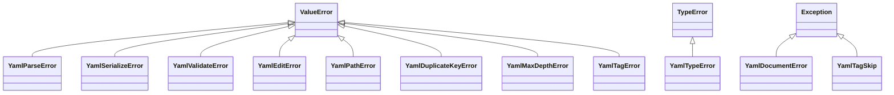

pyrs-yaml 定义了自定义异常类用于错误处理。



## YamlParseError

YAML 解析失败时引发。

```python
class YamlParseError(ValueError):
    """YAML 解析错误（继承自 ValueError）。"""
```

**继承自:** `ValueError`

**示例:**

```python
try:
    doc = pyrs_yaml.parse("invalid: yaml: [")
except pyrs_yaml.YamlParseError as e:
    print(f"解析错误: {e}")
```

**错误消息示例:**

- `Invalid YAML: line 1, column 15: did not find expected key`
- `YAML parse error at line 2, column 1: mapping values are not allowed here`

## YamlSerializeError

YAML 序列化失败时引发。

```python
class YamlSerializeError(ValueError):
    """YAML 序列化错误（继承自 ValueError）。"""
```

**继承自:** `ValueError`

**示例:**

```python
try:
    result = pyrs_yaml.safe_dump(float("inf"))
except pyrs_yaml.YamlSerializeError as e:
    print(f"序列化错误: {e}")
```

## YamlTypeError

类型转换错误时引发。

```python
class YamlTypeError(TypeError):
    """类型转换错误（继承自 TypeError）。"""
```

**继承自:** `TypeError`

**示例:**

```python
try:
    result = pyrs_yaml.safe_dump(object())  # 不可转换的类型
except pyrs_yaml.YamlTypeError as e:
    print(f"类型错误: {e}")
```

## YamlValidateError

JSON Schema 验证失败时引发。

```python
class YamlValidateError(ValueError):
    """JSON Schema 验证错误（继承自 ValueError）。"""
```

**继承自:** `ValueError`

**示例:**

```python
try:
    doc = pyrs_yaml.parse("age: not_a_number")
    doc.validate(schema={"type": "object", "properties": {"age": {"type": "number"}}})
except pyrs_yaml.YamlValidateError as e:
    print(f"验证错误: {e}")
```

## YamlEditError

当就地编辑无法应用时引发：不支持的值类型（`tuple`）、通过别名编辑、重命名根或复杂键、导航进入标量、索引越界。

```python
class YamlEditError(ValueError):
    """就地编辑错误（继承自 ValueError）。"""
```

**继承自:** `ValueError`

**示例:**

```python
doc = pyrs_yaml.parse("a:\n  b: 1")

try:
    doc.set("$.a.b.c", 2)  # 导航进入标量
except pyrs_yaml.YamlEditError as e:
    print(f"编辑错误: {e}")
```

## YamlPathError

当 JSONPath 风格路径格式错误或不可编辑时引发：路径不以 `$` 开头、编辑操作中使用通配符（`[*]`）或深度扫描（`..`）段。

```python
class YamlPathError(ValueError):
    """YAML 路径错误（继承自 ValueError）。"""
```

**继承自:** `ValueError`

**示例:**

```python
doc = pyrs_yaml.parse("items: [1, 2]")

try:
    doc.set("$.items[*]", 3)  # 通配符不可编辑
except pyrs_yaml.YamlPathError as e:
    print(f"路径错误: {e}")
```

## YamlDocumentError

当 `Node` 过期时引发 — 节点创建后文档被修改（或释放）。

```python
class YamlDocumentError(Exception):
    """节点的父 YamlDocument 过期时引发。"""
```

**继承自:** `Exception`

**示例:**

```python
node = doc.node().find("$.a")
doc.set("$.b", 2)  # 增加文档修订号
node.set_value(99)  # RuntimeWarning + YamlDocumentError
```

## YamlDuplicateKeyError

输入中检测到重复的映射键时引发。

```python
class YamlDuplicateKeyError(ValueError):
    """重复映射键错误（继承自 ValueError）。"""
```

**继承自:** `ValueError`

**示例:**

```python
try:
    pyrs_yaml.parse("key: 1\nkey: 2")
except pyrs_yaml.YamlDuplicateKeyError as e:
    print(f"重复键: {e}")
```

## YamlMaxDepthError

YAML 文档超过最大嵌套深度时引发。

```python
class YamlMaxDepthError(ValueError):
    """超过最大嵌套深度（继承自 ValueError）。"""
```

**继承自:** `ValueError`

**示例:**

```python
try:
    pyrs_yaml.parse("a:\n  b:\n    c:\n      ...", max_depth=2)
except pyrs_yaml.YamlMaxDepthError as e:
    print(f"超过最大深度: {e}")
```

## YamlTagError

标签处理器以无效名称或签名注册时引发。

```python
class YamlTagError(ValueError):
    """标签处理器错误（继承自 ValueError）。"""
```

**继承自:** `ValueError`

## YamlTagSkip

标签处理器抛出的哨兵异常，用于跳过节点。解析器会移到下一个节点而不是引发错误。这不是真正的错误，而是有意的控制流信号。

!!! info "控制流哨兵"
    `YamlTagSkip` 不是真正的错误。它是标签处理器将控制权委托给链中下一个处理器的信号。
    从处理器中抛出它会将控制权传递给下一个处理器（或回退到默认行为）。

```python
class YamlTagSkip(Exception):
    """标签处理器跳过的哨兵异常（继承自 Exception）。"""
```

**继承自:** `Exception`

**示例:**

```python
@pyrs_yaml.register_tag("!skip_me")
def handler(node):
    raise pyrs_yaml.YamlTagSkip
```

## 错误消息格式

所有错误消息都包含上下文信息：

| 错误 | 格式 |
|------|------|
| 解析错误 | `"YAML parse error: line N, column M: <message>"` |
| 文件未找到 | `"File read error: <path> — <OS error>"` |
| 无效 UTF-8 | `"Invalid UTF-8: <detail>"` |
| 键未找到 | `"Key not found: <key>"` |
| 索引超出范围 | `"Index out of range: <index> (len: <len>)"` |
| 不支持的类型 | `"Unsupported type for YAML conversion"` |
| ndarray 不支持的 dtype | `"Unsupported type for YAML conversion"` |
| Schema 验证失败 | `"<jsonschema error message>"` |
| 编辑失败 | `"YAML edit error: <detail>"` |
| 路径格式错误 | `"YAML path error: <detail>"` |

## i18n 支持

错误消息可以本地化：

```python
import pyrs_yaml

pyrs_yaml.set_language("zh-CN")  # 中文
try:
    pyrs_yaml.parse("invalid: yaml: [")
except pyrs_yaml.YamlParseError as e:
    print(e)  # 中文错误消息
```

## 最佳实践

```python
# 捕获具体的异常
try:
    doc = pyrs_yaml.parse(yaml_content)
except pyrs_yaml.YamlParseError as e:
    logger.error(f"YAML 解析错误: {e}")
    # 错误消息的解析
    error_str = str(e)  # "Invalid YAML: line 1, column 15: ..."
except pyrs_yaml.YamlTypeError as e:
    logger.error(f"类型错误: {e}")
```

**注意:** 大多数自定义异常继承自 `ValueError`（`YamlDocumentError` 继承自 `Exception`），因此可以用 `except ValueError` 批量捕获大部分错误。但为了更细粒度的错误处理，建议使用具体的异常类。
