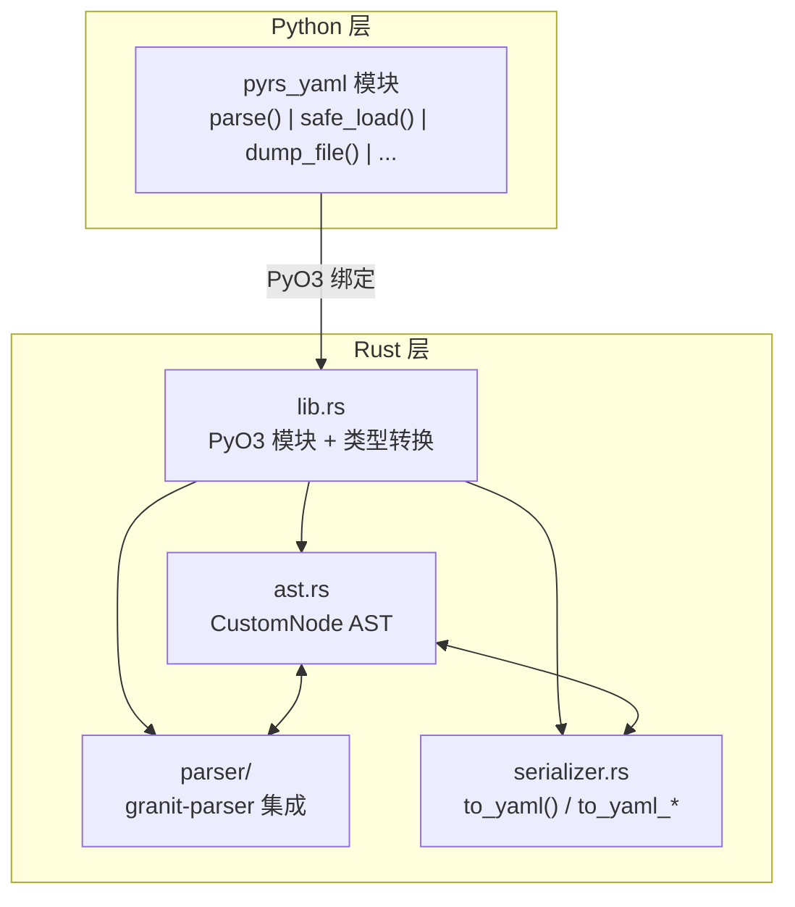
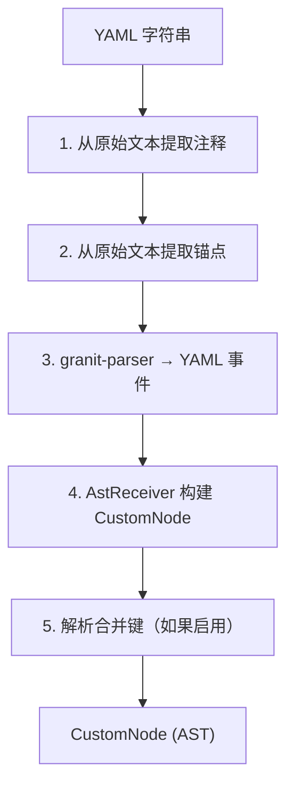
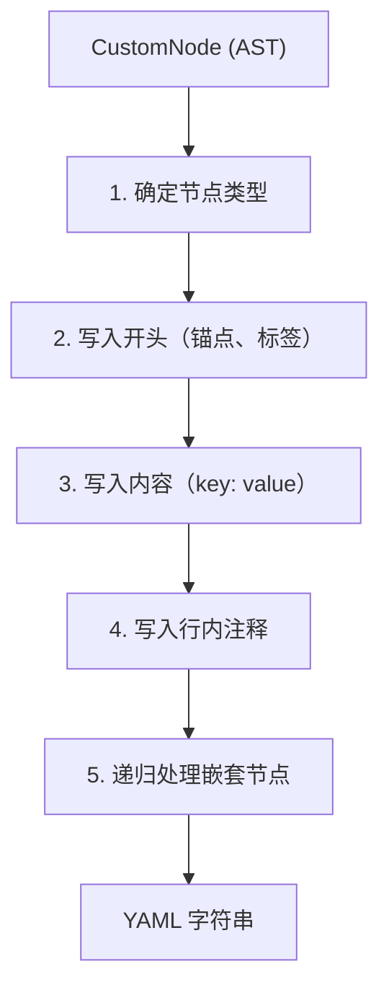

pyrs-yaml 使用为性能和正确性设计的模块化架构。

## 概述



## 工作区结构

代码库分为 `crates/` 下的两个 crate：

```text
crates/
├── pyrs-yaml-core/ # 纯 Rust，无 PyO3 依赖
│ └── src/
│   ├── lib.rs          # 重新导出所有核心模块
│   ├── ast.rs          # CustomNode AST
│   ├── editing/        # 编辑原语 (navigate, region, dirty, metadata)
│   ├── i18n.rs         # 国际化
│   ├── parser/         # YAML 解析器 (基于 granit)
│   ├── serializer.rs   # YAML 序列化器
│   └── splice.rs       # 基于分片拼接的文本组装
└── pyrs-yaml/          # PyO3 绑定层
    └── src/
        ├── lib.rs      # 重新导出核心 + 定义 #[pymodule]
        ├── py/         # PyO3 绑定
        │   ├── mod.rs      # YamlDocument pyclass
        │   ├── convert.rs  # CustomNode ↔ Python 类型转换
        │   └── editing/    # Python 层面的编辑包装器
        └── fidelity.rs # 基于属性的测试
```

## 模块架构

### 1. `crates/pyrs-yaml-core/src/ast.rs` — 自定义 AST

**CustomNode** 枚举是 pyrs-yaml 的核心：

- **Scalar** — 带样式（plain、引号、字面量、折叠）、注释、锚点、标签、chomping
- **Mapping** — 用于键顺序保留的 `IndexMap`、flow_style 标志
- **Sequence** — 有序列表、flow_style 标志
- **Null** — 带注释、锚点、标签
- **Alias** — 别名引用（仅名称）

#### 为什么使用自定义 AST？

- 标准 YAML 解析器会丢弃元数据（注释、格式）
- 自定义 AST 保留往返所需的一切
- 可扩展以支持未来功能（自定义节点类型、元数据）

#### 2. `crates/pyrs-yaml-core/src/parser/` — YAML 解析器

基于 **granit-parser**（YAML 1.2 兼容）构建：

- **`mod.rs`** — `AstReceiver` 状态机、基于事件的解析
- **`yaml/comment.rs`** — 从原始文本提取注释
- **`yaml/merge.rs`** — 合并键 (`<<`) 解析
- **`yaml/scalar.rs`** — 标量样式检测、反转义、chomping
- **`yaml/types.rs`** — YAML 1.2 类型解析（null、bool、int、float）

##### 关键设计决策

- 基于事件的 API（非基于令牌）— 更适合结构化输出
- 两遍解析：首先提取注释/锚点，然后解析事件
- 合并键解析在解析后进行（可配置）

#### 3. `crates/pyrs-yaml-core/src/serializer.rs` — YAML 序列化器

从 AST 重建 YAML 的自定义序列化器：

- **`to_yaml()`** — 使用默认选项序列化
- **`to_yaml_with_options()`** — 自定义缩进、标记、排序
- **`write_anchor_tag()`** — 锚点/标签输出辅助函数
- **`write_inline_comment()`** — 行内注释输出辅助函数

##### 关键设计决策

- 不使用第三方 emitter — 完全控制输出格式
- 嵌套结构的缩进级别状态管理
- 块标量的 chomping 指示符处理

#### 4. `crates/pyrs-yaml-core/src/editing/` — 编辑原语

纯 Rust 编辑原语，供 Python 层面的编辑 API 使用：

- **`navigate.rs`** — AST 路径导航（`navigate`、`navigate_mut`、`key_eq`、`mapping_key_index`、`normalize_index`、`parse_path_segments`）
- **`region.rs`** — 编辑区域计算（`path_nodes`、`region_unit`、`precompute`、行辅助函数、`extend_delete_over_comments`）
- **`dirty.rs`** — 编辑操作类型（`DirtyKind`、`DirtyUnit`）
- **`metadata.rs`** — 元数据保留（`with_metadata_from`）

#### 5. `crates/pyrs-yaml/src/py/` — PyO3 绑定

Python 层面的模块定义和类型转换：

- **`mod.rs`** — `YamlDocument` pyclass、`#[pymodule]` 入口
- **`convert.rs`** — Python ↔ CustomNode 转换和错误格式化
- **`python_types.rs`** — Python → CustomNode 类型转换
- **`ndarray.rs`** — NumPy ndarray 序列化（可选，`numpy` 特性）
- **`stream_events.rs`** — Python 的流事件类型
- **`streaming.rs`** — 流式解析（常量内存）
- **`writing.rs`** — 流式写入（常量内存）
- **`tag_registry.rs`** — Python 标签处理器注册
- **`editing/`** — Python 层面的编辑包装器（`segment_py.rs` + 从核心重新导出）

#### 5. `crates/pyrs-yaml/src/lib.rs` — 模块入口

- 重新导出所有模块
- 错误类型：`YamlParseError`、`YamlSerializeError`、`YamlTypeError`
- `create_exception!` 宏用于自定义 Python 异常
- `rust-i18n` 初始化

#### 6. `crates/pyrs-yaml-core/src/i18n.rs` — 国际化

- 配置和语言协商
- 语言包（en、zh-CN、ja-JP、ko-KR）
- 带格式字符串的双语错误消息

#### 7. `crates/pyrs-yaml-core/src/integration/` — 集成辅助

- `yaml_suite.rs` — YAML Test Suite 运行器，用于验证
- 基准测试和合规性检查的测试辅助函数

## 数据流

### 解析流



#### 序列化流



## 性能特性

| 操作 | 复杂度 | 说明 |
|------|--------|------|
| 解析 | O(n) | YAML 事件的单遍处理 |
| 序列化 | O(n) | AST 的单遍处理 |
| 往返 | O(n) | 解析 + 序列化 |
| 合并解析 | O(n × m) | n = 文档数，m = 每文档合并数 |
| 注释提取 | O(n) | 原始文本的单遍处理 |

## 依赖关系

| Crate | 用途 |
|-------|------|
| **PyO3** | Python 绑定（带 `experimental-inspect`） |
| **granit-parser** | YAML 1.2 兼容解析 |
| **IndexMap** | 键顺序保留的有序哈希映射 |
| **serde_json** | JSON ↔ YAML 转换 |
| **rust-i18n** | 国际化错误消息 |
