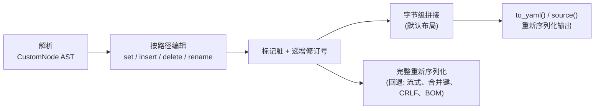

pyrs-yaml 允许您**就地编辑已解析的文档**，同时保留所有格式元数据（注释、锚点、标签、标量样式、流式/块式风格）——无需手动拼接字符串，也不会丢失任何保真度。

## 概述

编辑通过 **JSONPath 风格路径** 定位文档树中的节点：

```python title="按路径编辑"
import pyrs_yaml

doc = pyrs_yaml.parse("""
db:
  host: localhost
  port: 5432
""")

doc.set("$.db.host", "db.example.com")  # set by path
doc.set("$.db.port", 5433)
print(doc.to_yaml())
# db:
#   host: db.example.com
#   port: 5433
```

所有编辑方法都是**原子**的：失败时任何内容都不会改变，包括文档修订号。成功时文档被标记为脏，下一次调用 `source()` / `to_yaml()` / `to_yaml_with_options()` / `reparse()` 时会从更新后的树重新序列化。

### 编辑流水线



## 路径语法

路径以 `$` 开头，后跟以点分隔的键（映射）或 `[N]` 索引（序列）：

| 路径 | 含义 |
|------|------|
| `$.host` | 根映射的 `host` 键 |
| `$.a.b.c` | 嵌套键 |
| `$.items[0]` | 序列 `items` 的第一个元素 |
| `$` | 根节点本身 |

- **负索引**（`[-1]`、`[-2]`、...）**受支持** — 从序列末尾倒数（与 Python 语义一致：`-1` 是最后一个元素）。超出范围的负索引会抛出 `YamlEditError`
- 键**按值匹配**（与元数据无关），因此带引号的键 `"host"` 可以匹配普通键 `host`

编辑路径必须精确指向一个节点 — **通配符**（`[*]`）和**深度扫描**（`..`）会抛出 `YamlPathError`。（仅用于查询的 `find()` 支持它们；请参阅 [使用 `find()` 查询](#find)。）

对于格式错误的路径会**抛出** `YamlPathError`；当路径步骤无法应用时（例如导航进入标量，或通过别名编辑）抛出 `YamlEditError`。

## 设置值

### `set()` — 按路径替换

```python title="set() 签名"
set(path: str, value: Any) -> None
```

```python title="set() 示例"
doc = pyrs_yaml.parse("a:\n  b: 1\nitems: [1, 2, 3]")

doc.set("$.a.b", 42)  # scalar → scalar, metadata preserved
doc.set("$.items[1]", "two")  # sequence index
doc.set("$.a.c", True)  # add a new key to a mapping (last position)
doc.set("$", {"x": 1})  # replace the entire root
```

值转换规则：

| Python 值 | YAML 节点 |
|-----------|-----------|
| :material-format-text: `str`, :material-numeric: `int`, :material-decimal: `float`, :material-toggle-switch: `bool`, :material-null: `None` | 新标量（值*不会*被重新解析） |
| :material-language-python: `dict` | 新映射（普通样式） |
| :material-format-list-numbered: `list` | 新序列（普通样式） |
| :material-alert: `tuple` | 不支持 — 抛出 `YamlEditError` |

替换现有标量时，目标的元数据（行内注释、锚点、标签、引号样式）会被**保留** — 除非新值是映射/序列，此时采用新节点自身的格式。

#### `__setitem__` — 根节点语法糖

```python title="__setitem__ 根语法糖"
doc["b"] = 2  # equivalent to doc.set("$.b", 2)
```

#### `Node.set_value()` — 通过 Node 编辑

```python title="set_value()"
node = doc.node().find("$.a.b")  # see "Working with Nodes"
node.set_value(42)
```

## 插入与追加

两者都只对**序列**进行操作；路径必须解析为序列节点。

### `insert()` — 在索引处插入

```python title="insert() 签名"
insert(path: str, index: int, value: Any) -> None
```

`index` 最大可为当前长度（在 `len` 处插入等同于追加）；更大的值会抛出 `YamlEditError`。负索引从末尾计数（`-1` 在最后一个元素之前插入，`-len` 在开头插入）。

```python title="insert() 示例"
doc = pyrs_yaml.parse("items:\n  - a\n  - c")

doc.insert("$.items", 1, "b")  # items: [a, b, c]
doc.insert("$.items", 0, "first")
doc.insert("$.items", 3, "last")  # index == len appends
doc.insert("$.items", -1, "before-last")  # items: [a, before-last, c]
```

#### `append()` — 在末尾追加

```python title="append() 签名"
append(path: str, value: Any) -> None
```

```python title="append() 示例"
doc.append("$.items", "d")
```

#### `Node.append()` / `Node.insert()`

`Node` 对象上提供相同的操作：

```python title="Node append/insert"
node = doc.node().find("$.items")
node.append("d")
node.insert(1, "x")
```

## 删除

### `delete()` — 按路径删除

```python title="delete() 签名"
delete(path: str) -> None
```

```python title="delete() 示例"
doc = pyrs_yaml.parse("a: 1\nb: 2\nc: 3")
doc.delete("$.b")
print(doc.to_yaml())  # a: 1\nc: 3\n — order preserved
```

映射顺序始终保留；删除序列元素后会补齐空隙。

#### `__delitem__` — 根节点语法糖

```python title="__delitem__ 根语法糖"
del doc["b"]  # equivalent to doc.delete("$.b")
```

#### `Node.delete()`

```python title="Node.delete()"
node = doc.node().find("$.b")
node.delete()
```

## 重命名

### `rename()` — 就地重命名映射键

```python title="rename() 签名"
rename(path: str, new_key: str) -> None
```

路径必须指向一个**映射键**（其值位于该键下并保留元数据）：

```python title="rename() 示例"
doc = pyrs_yaml.parse("old: value  # keep me\nnext: 1")
doc.rename("$.old", "new")
print(doc.to_yaml())  # new: value  # keep me\nnext: 1
```

- **位置保留** — 重命名后的键保持在原位
- **元数据保留** — 键的行内注释、样式和锚点随重命名一起保留
- 重命名根节点、复杂（非标量）键，或重命名为**已存在的键**会抛出 `YamlEditError`（重命名为自身是无操作）

#### `Node.rename()`

```python title="Node.rename()"
node = doc.node().find("$.old")
node.rename("new")
```

## 标签与元数据

注释、锚点、标签默认在往返（round-trip）中保留。通过 `Node` 还可以读取和编辑它们——编辑会原地重新序列化，其余内容全部保留。

### 读取元数据

```python title="读取节点元数据"
doc = pyrs_yaml.parse("key: !!str value  # note")
node = doc.node().find("$.key")
node.comment  # "note"
node.anchor   # None
node.tag      # "!!str"
```

- `comment` — 行内或独立注释文本（不含 `#` 前缀），无注释时为 `None`
- `anchor` — 锚点名称，无锚点时为 `None`
- `tag` — YAML 标签字符串，无标签时为 `None`

#### `Node.set_comment()` / `Node.remove_comment()`

```python title="设置/移除注释"
node.set_comment("new note")                   # standalone：节点上方独占一行
node.set_comment("inline", standalone=False)   # 节点后行内
node.remove_comment()
```

#### `Node.set_anchor()` / `Node.remove_anchor()`

```python title="设置/移除锚点"
node.set_anchor("cfg")
node.remove_anchor()
```

锚点可被文档其他位置的别名引用。

#### `Node.set_tag()` / `Node.remove_tag()`

```python title="设置/移除标签"
node.set_tag("!custom")                  # 局部标签
node.set_tag("!!int")                    # 主（!!）标签
node.set_tag("!<tag:yaml.org,2002:str>") # verbatim 标签
node.remove_tag()
```

- 对**别名**节点（`*ref`）或**不存在的路径**编辑元数据会抛出 `YamlEditError`
- 编辑后节点变为 **stale**——下次访问前请用 `doc.node().find(path)` 重新查找

## 使用 Node

`doc.node()` 返回文档根节点的 `Node`；`Node.find(path)` 导航到子树：

```python title="Node 树导航"
node = doc.node()  # root node
node = doc.node().find("$.db.host")  # navigate by path
print(node.value)  # "localhost"
node.set_value("other")  # edit through the node
print(node.root_type)  # "scalar" | "mapping" | "sequence" | "null"
```

`Node` 提供树形 API：`node.parent`、`node.children`、`node.walk()`（深度优先迭代器）、`node.filter(predicate)` 和 `node.to_yaml()`。

=== "文档路径 API"

    ```python
    doc.set("$.db.host", "db.example.com")
    print(doc.find("$.db.host").value)
    ```

=== "Node API"

    ```python
    node = doc.node().find("$.db.host")
    node.set_value("db.example.com")
    print(node.value)
    ```

### 遍历 AST（`doc.walk()` / `doc.scalars()`）

`doc.walk()` 和 `doc.scalars()` 是**Rust 后端**的遍历方法，直接产生 `Node` 对象，无需将整个 AST 转换为 Python 字典。与 `Node.walk()`（底层调用 `to_dict()`）不同，这些方法直接遍历 AST：

```python title="Rust 后端遍历"
doc = pyrs_yaml.parse("a:\n  b: 1\n  c: 2\n")

# 遍历所有节点（深度优先，前序）
for node in doc.walk():
    print(node._path, node.root_type)
# ()       mapping
# ('a',)   mapping
# ('a', 'b') scalar
# ('a', 'c') scalar

# 仅遍历标量/null 节点
for node in doc.scalars():
    print(node._path, node.value)
# ('a', 'b') 1
# ('a', 'c') 2
```

对于大型文档，这比纯 Python 的 `Node.walk()` 快得多，尤其当您只需要路径信息或标量值时。

#### 创建缺失键（`create_missing=True`）

默认情况下，当路径中的中间键不存在时，`set()` 会抛出 `YamlEditError`。使用 `create_missing=True` 时，缺失的中间映射键会被自动创建：

```python title="create_missing 示例"
doc = pyrs_yaml.parse("a: 1\n")

# 不使用 create_missing — 抛出异常
doc.set("$.b.c.d", 2)  # YamlEditError: missing path

# 使用 create_missing — 创建 b → c → d
doc.set("$.b.c.d", 2, create_missing=True)
print(doc.to_yaml())
# a: 1
# b:
#   c:
#     d: 2
```

规则：

- 缺失的**映射键**会被创建为嵌套映射
- 缺失的**索引段**仍然会抛出异常（无法自动创建序列元素）
- 路径上的**标量**中间节点仍然会抛出异常（无法进入标量）
- 创建的链可以进行就地分片拼接编辑

#### 使用 `find()` 查询

`find()` 是**面向读取**的，支持通配符和深度扫描 — 当路径选中多个节点时返回列表：

```python title="find() 通配符"
doc.node().find("$.items[*]")  # all items of a sequence (list of Nodes)
doc.node().find("$..timeout")  # deep search for any key named "timeout"
```

通配符/深度扫描的结果**不能直接用 `set()` 编辑** — 如需在一次调用中对通配符路径应用值，请使用 `doc.set_many()`（见下）。

### 批量与结构编辑

#### `doc.set_many()` — 一次设置多个值

在单次 splice 突发中设置多个路径。路径可包含通配符（`[*]`）和深度扫描（`..`）— 所有匹配节点都会被设置：

```python title="set_many()"
doc = pyrs_yaml.parse("items:\n  - pass: true\n  - pass: true\n")
doc.set_many({
    "$.items[*].pass": False,   # 通配符：所有项
    "$.name": "config",          # 普通路径
})
```

#### `doc.sort_keys()` — 映射键排序

原地对映射（默认：根）的键进行排序：

```python title="sort_keys() 示例"
doc = pyrs_yaml.parse("z: 1\na: 2\nm: 3\n")
doc.sort_keys()           # 排序根映射
print(doc.to_yaml())      # a: 2\nm: 3\nz: 1
```

#### `Node.move(new_path)` — 移动子树

将子树移动到同一文档中的新路径（复制后删除源）：

```python title="Node.move() 示例"
doc = pyrs_yaml.parse("src:\n  x: 1\ndst: {}\n")
doc.node().find("$.src").move("$.dst")
print(doc.to_yaml())      # dst:\n  x: 1
```

#### `Node.path` / `Node.find_first()` / `Node.value_eq()`

```python title="Node 内省"
node = doc.node().find("$.a.b")
node.path                  # ('a', 'b') — 路径段
doc.node().find_first("$.items[*]")  # 第一个通配符匹配，无则 None
node.value_eq(other_node)  # 比较解析后的值（非引用同一性）
```

## 别名与合并键

!!! warning "穿透别名编辑"
    穿过别名导航到合并后的键进行编辑会抛出 `YamlEditError`，因为被引用的节点位于其他位置。请直接设置别名自身的路径以原地替换。

当设置别名节点（`*name`）自身的路径时，它会被**原地**替换：

```python title="别名替换"
yaml = "defaults: &defaults\n  timeout: 30\nprod: *defaults\n"
doc = pyrs_yaml.YAML(typ="safe").parse(yaml)  # resolve_merges=false keeps the alias node

doc.set("$.prod", {"timeout": 99})  # replaces the alias node — prod.timeout: 99
```

- **通过**别名设置（穿过 `*defaults` 导航到合并后的键）会抛出 `YamlEditError` — 被引用的节点位于其他位置
- 合并键已解析时（默认），合并展开的键是克隆；编辑它们只会修改克隆
- 允许删除带锚点的节点（锚点只是不再被引用）

## 视图与 AST

`doc.get()` / `doc.to_dict()` 返回**视图**（解析后的值）。编辑始终作用于 **AST**：

```python title="视图与 AST 示例"
doc = pyrs_yaml.parse("on: yes")
print(doc.get("on"))  # True   — view (core schema resolution)
doc.set("$.on", "off")  #         — edits the AST scalar
print(doc.to_yaml())  # on: off — serialized verbatim, no re-resolution
```

编辑后的值**原样**输出；视图根据当前生效的模式解析它。

## 过期节点

`Node` 与文档的**修订号**绑定，修订号在节点创建时记录。任何文档编辑（即使通过其他节点）都会增加修订号，因此之前获取的节点会过期：

```python title="过期节点示例"
node = doc.node().find("$.a")
doc.set("$.b", 2)  # bumps the revision
node.set_value(99)  # RuntimeWarning + YamlDocumentError (stale)
```

每次编辑后重新查找节点以继续工作。`node.is_valid()` 检查节点是否仍然有效；`node.release()` 显式将节点与其文档分离。

## 错误处理

| 错误 | 何时引发 |
|------|---------|
| :material-alert: `YamlPathError` | 格式错误的路径，编辑路径中使用通配符/`..` |
| :material-alert: `YamlEditError` | 不支持的值类型（`tuple`）、通过别名编辑、重命名根节点/复杂键/已存在的键、导航进入标量、索引越界 |
| :material-alert: `YamlDocumentError` | 文档编辑后使用过期的 `Node` |

所有编辑都是原子的 — 失败的编辑不会改动文档（及其修订号）。

## 完整示例

```python title="完整编辑示例"
import pyrs_yaml

doc = pyrs_yaml.parse("""
# server config
server:
  host: localhost  # bind address
  ports:
    - 8080
    - 9090
""")

doc.set("$.server.host", "0.0.0.0")
doc.insert("$.server.ports", 0, 80)
doc.append("$.server.ports", 443)
doc.rename("$.server", "srv")

print(doc.to_yaml())
# server config
# srv:
#   host: 0.0.0.0  # bind address
#   ports:
#     - 80
#     - 8080
#     - 9090
#     - 443
```

注释、锚点、标签、标量样式以及流式/块式格式全程保留。

## 性能

!!! tip "字节级拼接编辑"
    对于默认布局文档，编辑以字节级分片拼接方式应用，比全量重新序列化快 100 倍。

对于**默认布局**文档（块式风格、2空格缩进、无CRLF/BOM），编辑以**字节级分片拼接**方式应用 — 仅重新生成触碰区域，未触碰文本按字节复制。这使编辑+刷新比全量重新序列化**快100倍**。

**回退**（全量重新序列化）发生在以下情况：

- 被编辑节点或其祖先使用**流式风格**（`{...}`、`[...]`）
- 文档具有**非默认布局**（CRLF行尾、BOM、非标准缩进）
- 文档包含**合并键**（`<<: *anchor`）
- 从单个字符串解析了多个文档
- 分片状态被之前的 materialize **消耗**（单次爆发模型）

在所有回退情况下，正确性得到保证 — 仅失去性能优势。

### 基准测试

```text title="基准测试结果"
Benchmark                   Median
serialize_10mb             17 ms
edit_flush_set_10mb       110 ms
edit_flush_burst5_10mb    119 ms
```

测得于包含500组×838个键的合成10MB块映射文档。比率受AST克隆成本（56ms）主导；实际编辑+materialize约54ms（3倍于序列化）。对于包含注释、锚点和标签的复杂文档，分片优势显著增长。

---

### 另请参阅

- [解析 YAML](parsing.md) — 在编辑前解析文档
- [流式解析](streaming.md) — 大文件增量解析
- [配置管理](tutorial-config-management.md) — 端到端编辑实战
